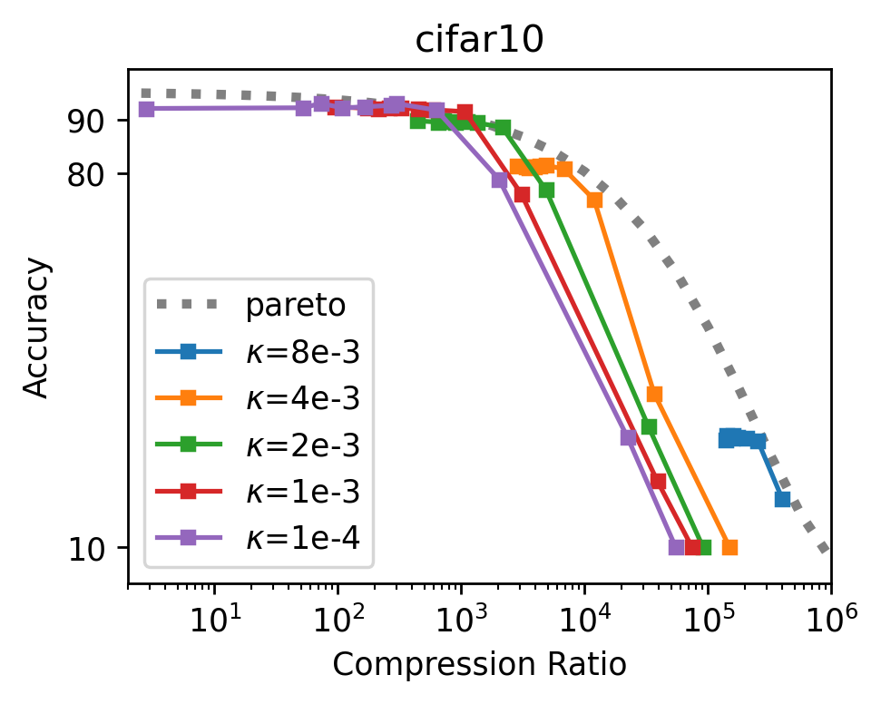

# Sparsity by Redundancy

Spred is a method that allows one to optimize L1 penalties using any gradient-descent-based methods in standard deep learning frameworks. This repository implements the spred (sparsity by redundancy) method for several deep learning models for image classification in PyTorch. 

The models.py contains the implementation following models
- MLP `models/mlp.py`
- VGG `models/vgg.py`
- ResNet `models/resnet.py`

This code can be ran on the CIFAR10 and CIFAR100 datasets

## Demonstration on a Lasso / Compressive Sensing Task
See the jupyter notebook in the demonstration folder. We note that this implementation is minimal. For more advanced implementations, see the files in models/.


## Running the code for CIFAR

Script `run.sh` illustrates a typical workaround for obtaining sparse ResNet18.

1. Train the model
```
python pretrain.py --dataset=$dataset \
                   --wd=$pretrain_wd \
                   --device=$device \
                   --output_path=$pretrain_output_path
```
2. Prune the neural network with a certain threshold and finetune the sparse network
```
python3 finetune.py --lr=1e-4 \
                    --threshold=$thr \
                    --device=$device \
                    --dataset=$dataset \
                    --resume_path $pretrain_output_path \
                    --output_path finetune/${dataset}_pretrain_wd_${pretrain_wd}/thr_${thr}
```

### Examplary Results on CIFAR-10



CIFAR10 results are obtained by running
```
run.sh cifar10 ${kappa} cuda:0
```

### Examplary Results on CIFAR-109


CIFAR-100 results are obtained by running
```
run.sh cifar100 ${kappa} cuda:0
```


## Prerequisites
- Python 3.6+
- PyTorch 1.0+
