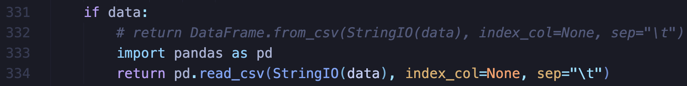

# Spred: Solving L1 with SGD

This is the repository for the paper Spred: Solving L1 with SGD.

The subtasks are contained into different folders

## Environment

The conda environment can be found in `enironment.yml`

We note that there will be some compatibility issue to load the cancer datasets. An adhoc fix is to change the line 322 of `GEOparse.py` into line 323-324, as indicated in the following picture.

## Task1: Linear regression

The first task is described in folder `linear`. Please check the `linear/readme.md`

## Task2: Non-linear classification in high-dimensional dataset

The second task is non-linear classification in high-dimensional dataset, where the labels of genes are predicted. Please check the `non-linear/readme.md`

## Task3: Image classification on CIFAR10 and CIFAR100

The third task is to leverage the training protocal of STR. The original repository can be found in [this link](https://github.com/RAIVNLab/STR). We modify the model implementation.

Please check scripts with `run_{STR/spred/L1}_{cifar10/cifar100}.sh` for the usage on CIFAR datasets.

This repo can be also used to run experiments on Imagenet.

## (Legancy) previous implementation of CIFAR dataset.

The CIFAR results in [earlier version](https://arxiv.org/abs/2210.01212v1) is implemented in folder `CIFAR (old)`.